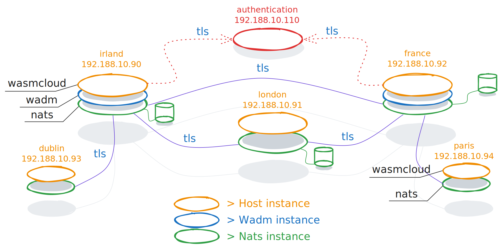

#+title: Demo

* Introduction
Just to present a short overview of Wasmcloud.
** Overview Platform

* Installation
** Proxmox
We check the /variables.tf/ file to set the proxmox configuration. I just show the important parameters
#+begin_src emacs-lisp
variable "cloudinit" { default = "storage" }
variable "target_node" { default = "inspire" }
variable "storage" { default = "storage" }
#+end_src
About credentials, we need to provide as private parameters
#+begin_src emacs-lisp
variable "token" {}
variable "token_id" {}
variable "fqdn_pmox" {}
#+end_src
** Proxy and DNS
The proxy and DNS are important to download and set communication in NATS layer
#+begin_src emacs-lisp
variable "proxy" { default = "http://proxy.fr:8080" }
variable "nameserver" { default = "10.192.65.254" }
#+end_src
** User, Private and public key
To have an access on different VMs, we need to provide ssh parameters used essentially on _Ansible_
#+begin_src emacs-lisp
variable "userctn" { default = "spike" }
variable "publkeyctn" { default = "~/.ssh/id_ed25519_proxmox.pub" }
variable "privkeyctn" { default = "~/.ssh/id_ed25519_proxmox" }
#+end_src
Don't forget to modify the public key on  //mnt/pve/storage/snippets/cloudinit.yml/
* Platform System
** Nats Daemon
#+begin_src shell
$ systemctl status nats-server
#+end_src
** Wadm Daemon
#+begin_src shel;
$ systemctl status wadm-service
#+end_src
** Wasmcloud Daemon
#+begin_src shell
$ systemctl status wasmcloud-service
#+end_src
* Ncs
** Keys
these different command are done on /oracle/
#+begin_src shell
$ nsc list keys -A
+--------------------------------------------------------------------------------------------------+
|                                               Keys                                               |
+----------------+----------------------------------------------------------+-------------+--------+
| Entity         | Key                                                      | Signing Key | Stored |
+----------------+----------------------------------------------------------+-------------+--------+
| wasmcloud      | OBEXXRNYIKUQTHJ4ML4WDBRVQPWJIYBDQL3R54V6NKJM25T26SHHPBUE |             | *      |
|  SYS           | ACA6FHA5FJZHUQDPHXA6OFWT5H3NVSYZDFMT7WJF7KPBCRNLPMS6SHEV |             | *      |
|   sys          | UB4YQ7M2CZSPGBJVRL2RJFGLCQN5DKFJPB2U4GAWKPZCDJOHZGHX6TO4 |             | *      |
|  WADM          | ADA2HP5DTH53PMT73BLYFX2ZUTU6KI5JWCGOZC6ITTJOZNXHDKFT5IJP |             | *      |
|   wadmapp      | UCOGVSV6AXIMCJKE66FZCGSRCRMMXMBUVODAJLOMNTPVH2YIWNMHZCSX |             | *      |
|   wadmconsumer | UD54CAYHWDQ5R3F7DBISA7VCP7VMLY77GOXO7JGOWMMGSTHUISVWFJNO |             | *      |
+----------------+----------------------------------------------------------+-------------+--------+
#+end_src
** Operator
#+begin_src shell
$ nsc describe operator
+---------------------------------------------------------------------------------------+
|                                   Operator Details                                    |
+----------------------+----------------------------------------------------------------+
| Name                 | wasmcloud                                                      |
| Operator ID          | OBEXXRNYIKUQTHJ4ML4WDBRVQPWJIYBDQL3R54V6NKJM25T26SHHPBUE       |
| Issuer ID            | OBEXXRNYIKUQTHJ4ML4WDBRVQPWJIYBDQL3R54V6NKJM25T26SHHPBUE       |
| Issued               | 2025-07-18 13:44:48 UTC                                        |
| Expires              |                                                                |
| System Account       | ACA6FHA5FJZHUQDPHXA6OFWT5H3NVSYZDFMT7WJF7KPBCRNLPMS6SHEV / SYS |
| Require Signing Keys | false                                                          |
+----------------------+----------------------------------------------------------------+
#+end_src
** Account
#+begin_src shell
$ nsc describe account -n WADM
+--------------------------------------------------------------------------------------+
|                                   Account Details                                    |
+---------------------------+----------------------------------------------------------+
| Name                      | WADM                                                     |
| Account ID                | ADA2HP5DTH53PMT73BLYFX2ZUTU6KI5JWCGOZC6ITTJOZNXHDKFT5IJP |
| Issuer ID                 | OBEXXRNYIKUQTHJ4ML4WDBRVQPWJIYBDQL3R54V6NKJM25T26SHHPBUE |
| Issued                    | 2025-07-18 13:44:48 UTC                                  |
| Expires                   |                                                          |
+---------------------------+----------------------------------------------------------+
| Max Connections           | Unlimited                                                |
| Max Leaf Node Connections | Unlimited                                                |
| Max Data                  | Unlimited                                                |
| Max Exports               | Unlimited                                                |
| Max Imports               | Unlimited                                                |
| Max Msg Payload           | Unlimited                                                |
| Max Subscriptions         | Unlimited                                                |
| Exports Allows Wildcards  | True                                                     |
| Disallow Bearer Token     | False                                                    |
| Response Permissions      | Not Set                                                  |
+---------------------------+----------------------------------------------------------+
| Jetstream                 | Enabled                                                  |
| Max Disk Storage          | Unlimited                                                |
| Max Mem Storage           | Unlimited                                                |
| Max Streams               | Unlimited                                                |
| Max Consumer              | Unlimited                                                |
| Max Ack Pending           | Consumer Setting                                         |
| Max Ack Pending           | Unlimited                                                |
| Max Bytes                 | optional (Stream setting)                                |
| Max Memory Stream         | Unlimited                                                |
| Max Disk Stream           | Unlimited                                                |
+---------------------------+----------------------------------------------------------+
| Imports                   | None                                                     |
| Exports                   | None                                                     |
+---------------------------+----------------------------------------------------------+
| Tracing Context           | Disabled                                                 |
+---------------------------+----------------------------------------------------------+
#+end_src
** User
#+begin_src shel
$ nsc describe user -a WADM -n wadmapp
+------------------------------------------------------------------------------------+
|                                        User                                        |
+-------------------------+----------------------------------------------------------+
| Name                    | wadmapp                                                  |
| User ID                 | UCOGVSV6AXIMCJKE66FZCGSRCRMMXMBUVODAJLOMNTPVH2YIWNMHZCSX |
| Issuer ID               | ADA2HP5DTH53PMT73BLYFX2ZUTU6KI5JWCGOZC6ITTJOZNXHDKFT5IJP |
| Issued                  | 2025-07-18 13:44:49 UTC                                  |
| Expires                 |                                                          |
| Bearer Token            | No                                                       |
+-------------------------+----------------------------------------------------------+
| Pub Allow               | $JS.>                                                    |
|                         | $KV.>                                                    |
|                         | $SYS.>                                                   |
|                         | wadm.>                                                   |
|                         | wasmbus.ctl.>                                            |
|                         | wasmbus.evt.>                                            |
|                         | wasmbus.rpc.>                                            |
| Sub Allow               | _INBOX.>                                                 |
|                         | wadm.api.>                                               |
|                         | wasmbus.ctl.v1.>                                         |
|                         | wasmbus.evt.*.>                                          |
|                         | wasmbus.rpc.>                                            |
| Max Responses           | 1                                                        |
| Response Permission TTL | 0s                                                       |
+-------------------------+----------------------------------------------------------+
| Max Msg Payload         | Unlimited                                                |
| Max Data                | Unlimited                                                |
| Max Subs                | Unlimited                                                |
| Network Src             | Any                                                      |
| Time                    | Any                                                      |
+-------------------------+----------------------------------------------------------+
#+end_src
* Nats
** Checks
We suppose to be located on the cluster, one of the 3 servers.
#+begin_src shell
$ nats server list --creds /srv/nats/sys.creds
╭────────────────────────────────────────────────────────────────────────────────────────────────────────────────────╮
│                                                   Server Overview                                                  │
├────────┬───────────┬──────┬─────────┬───────────┬───────┬───────┬────────┬─────┬────────┬───────┬───────┬──────┬── ≈
│ Name   │ Cluster   │ Host │ Version │ JS        │ Conns │ Subs  │ Routes │ GWs │ Mem    │ CPU % │ Cores │ Slow │ U ≈
├────────┼───────────┼──────┼─────────┼───────────┼───────┼───────┼────────┼─────┼────────┼───────┼───────┼──────┼── ≈
│ irland │ wasmcloud │ 0    │ 2.10.7  │ wasmcloud │ 1     │ 363   │      8 │   0 │ 22 MiB │ 0     │     1 │ 0    │ 7 ≈
│ france │ wasmcloud │ 0    │ 2.10.7  │ wasmcloud │ 2     │ 365   │      8 │   0 │ 27 MiB │ 0     │     1 │ 0    │ 1 ≈
│ london │ wasmcloud │ 0    │ 2.10.7  │ wasmcloud │ 0     │ 363   │      8 │   0 │ 32 MiB │ 0     │     1 │ 0    │ 1 ≈
├────────┼───────────┼──────┼─────────┼───────────┼───────┼───────┼────────┼─────┼────────┼───────┼───────┼──────┼── ≈
│        │ 1         │ 3    │         │ 3         │ 3     │ 1,091 │        │     │ 82 MiB │       │       │ 0    │   ≈
╰────────┴───────────┴──────┴─────────┴───────────┴───────┴───────┴────────┴─────┴────────┴───────┴───────┴──────┴── ≈

╭──────────────────────────────────────────────────────────────────────────────╮
│                               Cluster Overview                               │
├───────────┬────────────┬───────────────────┬───────────────────┬─────────────┤
│ Cluster   │ Node Count │ Outgoing Gateways │ Incoming Gateways │ Connections │
├───────────┼────────────┼───────────────────┼───────────────────┼─────────────┤
│ wasmcloud │          3 │                 0 │                 0 │           3 │
├───────────┼────────────┼───────────────────┼───────────────────┼─────────────┤
│           │          3 │                 0 │                 0 │           3 │
╰───────────┴────────────┴───────────────────┴───────────────────┴─────────────╯
#+end_src
The more easier access consist to use then contexts
#+begin_src shell
$ nats context ls
╭─────────────────────────────╮
│        Known Contexts       │
├───────────────┬─────────────┤
│ Name          │ Description │
├───────────────┼─────────────┤
│ main-consumer │             │
│ main-sys      │             │
│ main-wadmapp* │             │
╰───────────────┴─────────────╯
$ nats context select main-sys
$ nats context ls
╭─────────────────────────────╮
│        Known Contexts       │
├───────────────┬─────────────┤
│ Name          │ Description │
├───────────────┼─────────────┤
│ main-consumer │             │
│ main-sys*     │             │
│ main-wadmapp  │             │
╰───────────────┴─────────────╯
#+end_src
** Jetstream
Now that all is done, we list the stream by using
+ main-consumer
+ main-wadmapp
#+begin_src shell
$ nats kv list
╭──────────────────────────────────────────────────────────────────────────────────────────╮
│                                     Key-Value Buckets                                    │
├─────────────────────┬─────────────┬─────────────────────┬─────────┬────────┬─────────────┤
│ Bucket              │ Description │ Created             │ Size    │ Values │ Last Update │
├─────────────────────┼─────────────┼─────────────────────┼─────────┼────────┼─────────────┤
│ CONFIGDATA_default  │             │ 2025-06-16 19:17:35 │ 0 B     │ 0      │ never       │
│ LATTICEDATA_default │             │ 2025-06-16 19:17:34 │ 0 B     │ 0      │ never       │
│ wadm_manifests      │             │ 2025-06-16 19:17:35 │ 0 B     │ 0      │ never       │
│ wadm_state          │             │ 2025-06-16 19:17:36 │ 1.1 KiB │ 3      │ 2.72s       │
╰─────────────────────┴─────────────┴─────────────────────┴─────────┴────────┴─────────────╯
#+end_src
and for stream parameters
#+begin_src shell
$ nats stream list
╭─────────────────────────────────────────────────────────────────────────────────────────────────────────────────────────────────────────────────────────────────────────╮
│                                                                                 Streams                                                                                 │
├─────────────────────┬─────────────────────────────────────────────────────────────────────────────────────────┬─────────────────────┬──────────┬─────────┬──────────────┤
│ Name                │ Description                                                                             │ Created             │ Messages │ Size    │ Last Message │
├─────────────────────┼─────────────────────────────────────────────────────────────────────────────────────────┼─────────────────────┼──────────┼─────────┼──────────────┤
│ wadm_commands       │ A stream that stores all commands for wadm                                              │ 2025-07-10 20:25:22 │ 0        │ 0 B     │ never        │
│ wadm_event_consumer │ A stream that sources from wadm_events and wasmbus_events for wadm event consumer's use │ 2025-07-10 20:25:22 │ 0        │ 0 B     │ 12.48s       │
│ wadm_events         │ A stream that stores all events coming in on the wadm.evt subject in a cluster          │ 2025-07-10 20:25:22 │ 0        │ 0 B     │ never        │
│ wadm_notify         │ A stream for capturing all notification events for wadm                                 │ 2025-07-10 20:25:22 │ 0        │ 0 B     │ never        │
│ wadm_status         │ A stream that stores all status updates for wadm applications                           │ 2025-07-10 20:25:22 │ 0        │ 0 B     │ never        │
│ wasmbus_events      │ A stream that stores all events coming in on the wasmbus.evt subject in a cluster       │ 2025-07-10 20:25:22 │ 10       │ 6.1 KiB │ 12.48s       │
╰─────────────────────┴─────────────────────────────────────────────────────────────────────────────────────────┴─────────────────────┴──────────┴─────────┴──────────────╯
#+end_src
* Platform Architecture
** Context
#+begin_src shell
$ wash ctx list

== Contexts found in /home/spike/.wash/contexts ==
host_config
consumer
wadmapp (default)
#+end_src
We now create a context for the /consumer/  profile
#+begin_src shell
$ wash ctx new consumer

Created context consumer with default values
#+end_src
And after some modification
#+begin_src shell
$ wash ctx edit consumer
#+end_src
We obtain a minimum to work
#+begin_src shell
$ cat /home/spike/.wash/contexts/consumer.json
{
    "name":"consumer",
    "cluster_seed":"",
    "ctl_host":"127.0.0.1",
    "ctl_port":4222,
    "ctl_jwt":"",
    "ctl_seed":"",
    "ctl_credsfile":"/srv/creds/consumer.creds",
    "ctl_timeout":2000,
    "ctl_tls_ca_file":null,
    "ctl_tls_first":null,
    "lattice":"default",
    "js_domain":"wasmcloud",
    "rpc_host":"127.0.0.1",
    "rpc_port":4222,
    "rpc_jwt":"",
    "rpc_seed":"",
    "rpc_credsfile":null,
    "rpc_timeout":2000,
    "rpc_tls_ca_file":null,
    "rpc_tls_first":null
}
#+end_src
Just to notice that the account (spike for this example) must be included in the *nats* /group/ .
#+begin_src shell
$ id
uid=1000(spike) gid=1000(spike) groups=1000(spike),100(users),104(admin),106(nats)
#+end_src
** Hosts list
#+begin_src shell
$ wash get hosts

  Host ID                                                      Friendly name         Uptime (seconds)
  NCTBVCQMOEXF2C7XXF56R7WOHYRP35GAAFFYVS3I2DZL2QRRRQ7YDORG     mauve-forest-0307     9033
  NBBIPNOGMYA5GEQQXJKIEEDFZYLJAXD7WAQNOIWABWPEJATIHDPFO5ZB     hidden-sun-9928       9030
  ND4QZRDUOBM5UCL7GSM2NGNRIAE4CCMRK4LUKDJU6EEW3IY7MA42XGAY     ancient-flower-2874   9027
  NADGILZCZN7WX6PBIR2WSJ33UBINY3IH3IIONEM6SR5IIDXA7CTE3KC5     restless-fire-0808    9024
#+end_src
** More information
#+begin_src shell
$ wash get inventory

  Host ID                                                       Friendly name
  NAFTQBLJPENRFWWBBXN6WVX23GD444JASCUPNYB624CJPSKYXLEN3ZZT      spring-glitter-0944

  Host labels
  hostcore.arch                  x86_64
  hostcore.os                    linux
  hostcore.osfamily              unix
  zone                           dublin

  No components found

  No providers found

  Host ID                                                       Friendly name
  NAVW3J3FKQGBO2JK6JDUDYBGKEV5GBOQ4PLDCZJJBCDJRJMOXUDDDZDO      empty-dust-3892

  Host labels
  hostcore.arch                  x86_64
  hostcore.os                    linux
  hostcore.osfamily              unix
  zone                           irland

  No components found

  No providers found

  Host ID                                                       Friendly name
  NCLSSYMKNKN2XC3ESPVZE5HETH73CCSVBA4PBS7GJX63RPT24UOTI5AE      lively-shadow-7667

  Host labels
  hostcore.arch                  x86_64
  hostcore.os                    linux
  hostcore.osfamily              unix
  zone                           london

  No components found

  No providers found

  Host ID                                                       Friendly name
  NDWQDWC5YQSKSSUDZIVQQOM4B5LJECDL5CELICTY6A5TXSOMJ6F73UHU      dark-shadow-1958

  Host labels
  hostcore.arch                  x86_64
  hostcore.os                    linux
  hostcore.osfamily              unix
  zone                           france

  No components found

  No providers found
#+end_src
* Manifest
** Labels and percentage
#+begin_src shell
        - type: spreadscaler
          properties:
            instances: 2
            spread:
              - name: london
                weight: 50
                requirements:
                  zone: london
              - name: dublin
                weight: 50
                requirements:
                  zone: dublin
#+end_src
** Labels and daemon
#+begin_src shell
        - type: daemonscaler
          properties:
            instances: 2
            spread:
              - name: london
                requirements:
                  zone: london
              -  name: dublin
                requirements:
                  zone: dublin
#+end_src
* Scenario
** Proxy
#+begin_src emacs-lisp
export http_proxy="http://proxy.rd.francetelecom.fr:8080"
export https_proxy="http://proxy.rd.francetelecom.fr:8080"
export no_proxy="127.0.0.1,localhost,192.189.190.110"
#+end_src
** Deployment
#+begin_src shell
$ wash app deploy wadm.conf
#+end_src
** Visualization per application
#+begin_src shell
$ wash app list

  Name                                  Deployed Version                      Status
  rust-hello-world                      01JF7PEXK75GWZZTP6CHPJYENH            Deployed
    └ HTTP hello world demo in Rust, using the WebAssembly Component Model and WebAssembly Interfaces Types (WIT)
#+end_src
** Visualization per instance
#+begin_src shell
$ wash app status rust-hello-world

rust-hello-world@ - Deployed

  Name                                         Kind           Status
  http_component                               SpreadScaler   Deployed
  httpserver                                   SpreadScaler   Deployed
  httpserver -(wasi:http)-> http_component     LinkScaler     Deployed
#+end_src
** Push Registry
#+begin_src shell
$ wash push --insecure 192.189.190.110:5000/http_hello_world:0.1.0 ./build/http_hello_world_s.wasm
#+end_src
** View Registry
#+begin_src shell
$ curl --proxy "" -X GET http://192.189.190.110:5000/v2/_catalog
{"repositories":["http_hello_world"]}
#+end_src
** Registry and manifest
#+begin_src shell
    - name: http-component
      type: component
      properties:
        # image: file://./build/http_hello_world_s.wasm
        # To use the a precompiled version of this component, use the line below instead:
        image: 192.189.190.110:5000/http_hello_world:0.1.0
      traits:
        # Govern the spread/scheduling of the component
#+end_src
* Graphic
** Export
All commands are on the local machine
#+begin_src shell
$ ssh -L 4222:127.0.0.1:4222 -L 4223:127.0.0.1:4223  spike@192.188.40.90 -i ~/.ssh/id_ed25519_proxmox
#+end_src
and finally
#+begin_src shell
$ wash ui
#+end_src
** Curl
#+begin_src shell
$ curl -o /dev/null -s -w 'Total: %{time_total}s\n'  127.0.0.1:8000
$ curl -o /dev/null -s -w 'Establish Connection: %{time_connect}s\nTTFB: %{time_starttransfer}s\nTotal: %{time_total}s\n' 127.0.0.1:8000
#+end_src

* Scenario
** NCS Controller

- [ ] nsc list keys -A
- [ ] nsc describe operator
- [ ] nsc describe account  -n WADM
- [ ] nsc describe user -a WADM -n wadmapp
- [ ] nsc edit user -a WADM -n wadmapp —allow-pub “orange.>”
- [ ] nsc describe user -a WADM -n wadmapp

** Cluster Server

- [ ] systemctl status nats-server
- [ ] sudo -s
- [ ] emacs /etc/nats-server.conf
- [ ] nats context ls
- [ ] nats context select main-sys
- [ ] nats server list
- [ ] nats account info
- [ ] nats context select main-wadmapp
- [ ] nats context list
- [ ] nats account info
- [ ] nats stream list
- [ ] nats kv list

** Leaf Server

- [ ] id
- [ ] nats account info
- [ ] sudo usermod -aG nats spike
- [ ] nats context add ctx-spike --creds /src/creds/wadmapp.creds --colors green
- [ ] nats context list
- [ ] nats context select ctx-spike
- [ ] systemctl status nats-server
- [ ] emacs /etc/nats-server.conf
- [ ] wash get inventory
- [ ] wash get hosts
