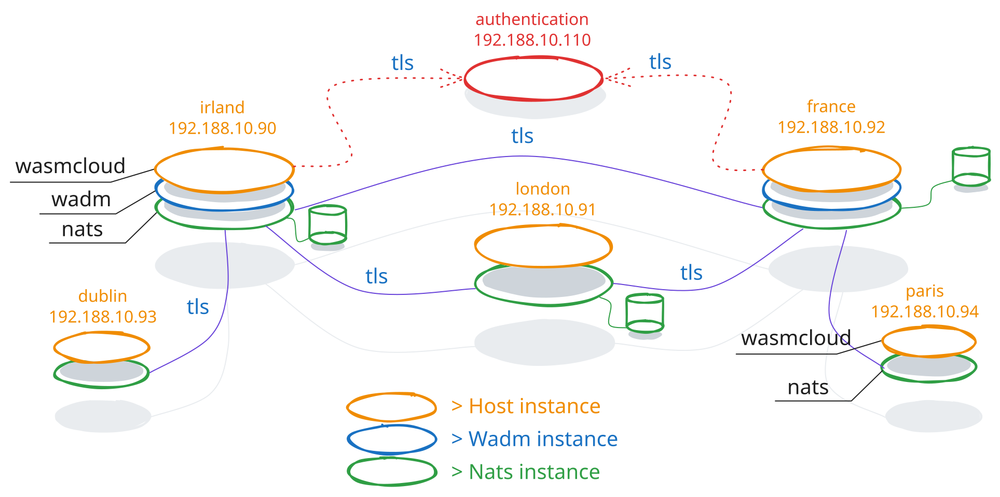

#+title: Batou

* Introduction
** Objective
To build a quiet simple /WasmCloud/ cluster and some leafs, just for fun.
** Overview

The IP address depend of your platform, so ...
* Install
** Process
+ Check the /variables.tf/ file to define the architecture
+ Check the /main.tf/ to define the /subnet/ and /VLAN/
+ VMs are connected on /vmbr3/ bridge though an opnsense instance
+ template is just a simple ubuntu template downloaded on the net
Just to notice that more information relative to the architecture is added on [[./DEMO.org][DEMO.org]]
